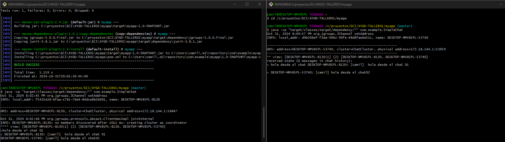

# AYGO-TALLER01

## SimpleChat 

Este proyecto es una implementación de un chat distribuido usando JGroups, que permite a múltiples usuarios unirse a un clúster y enviar mensajes en tiempo real. Cada mensaje es propagado a todos los participantes, y se puede capturar el estado actual del chat, de manera que nuevos miembros puedan obtener el historial de mensajes al unirse.

# Manual para Compilar y Ejecutar el proyecto de manera local


## Paso 1: Clonar o Acceder al Proyecto

Si aún no tienes el proyecto en tu máquina, clónalo o navega al directorio del proyecto. Usa el siguiente comando para clonar desde un repositorio:
```bash
git clone https://github.com/Rincon10/AYGO-TALLER01.git
```


```bash
cd myapp
```

## Paso 2: Compilar el Proyecto con Maven

n el directorio raíz del proyecto, ejecuta el siguiente comando 

```bash
mvn clean install
```

### Paso 3: Comandos para ejecutar la aplicacion 

```bash
mvn exec:java -D exec.mainClass="com.exmple.SimpleChat"
```

o

### Windows


```bash
java -cp "target/classes;target/dependency/*" com.example.SimpleChat
```

### Linux

```bash
java -cp "target/classes:target/dependency/*" com.example.SimpleChat
```

se deberia ver lo siguiente en la terminal, en este caso iniciamos dos chats de manera paralela



## Manual de creacion de imagen docker

vamos a crear la imagen docker:
### Comandos Docker

```bash 
docker build --tag rincon10/servicio-chats:1.0 .
```


entonces ahora ejecutamos  la imagen que se creo a partir del dockerFile que tenemos

intancia 1
```bash
docker run -i --network "host" --name instancia1-servicio-chat rincon10/servicio-chats:1.0
```

intancia 2
```bash
docker run -i --network "host" --name instancia2-servicio-chat rincon10/servicio-chats:1.0
```

si todo sale bien veriamos que el contenedor se esta ejecutando de manera correcta con 

